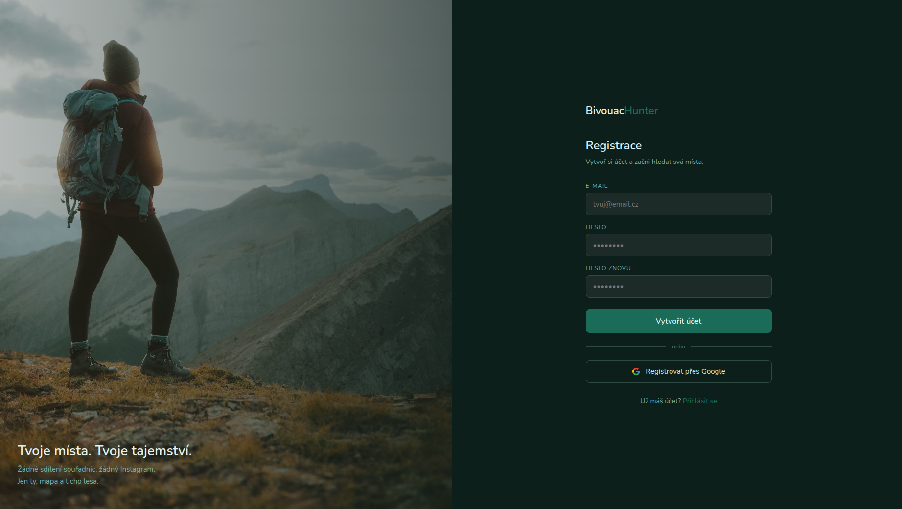

# 🏕️ BivouacHunter

> *Digitální protipól k sociálním sítím. Diskrétní a bezpečný průvodce divočinou.*

## Náhled



---

## Proč BivouacHunter?

Jako žena věnující se solo turistice a spaní venku vnímám dva zásadní problémy současných mapových aplikací:

- **Ztráta soukromí** kvůli masovému sdílení míst na sociálních sítích
- **Pocit nejistoty** při plánování noclehu o samotě

BivouacHunter je odpovědí na obojí. Namísto sdílení *instafriendly* souřadnic slouží jako **diskrétní a bezpečný průvodce divočinou** – aplikace, která hikerům umožňuje najít klidná místa pro bivakování na základě technických parametrů, nikoli popularity.

---

## Co aplikace umí

- 🗺️ **Turistická mapa** – podklad mapy.cz s turistickými značkami, pěšinami a vrstevnicemi
- 📍 **Bivouac spoty** – místa s technickými parametry (terén, orientace svahu, zdroj vody, přístřešek, expozice větru, nadmořská výška)
- 🔍 **Filtrování** – podle orientace, terénu, vzdálenosti od vody a přístřešku
- 🔒 **Anonymita** – žádné sociální prvky, minimální sběr dat

---

## Tech stack

- **Backend:** Python / Django
- **Databáze:** SQLite (vývoj)
- **Mapa:** Leaflet.js + Mapy.cz API
- **Frontend:** HTML, CSS, JavaScript

---

## Aktuální stav

Projekt je ve fázi aktivního vývoje (MVP).

### Hotovo ✅
- Django projekt a databázový model pro bivouac místa
- Admin rozhraní pro správu spotů
- Interaktivní mapa s turistickým podkladem mapy.cz
- Filtrační panel – dropdown menu (orientace, terén, voda, přístřešek, vítr, výška)
- Popup s technickými parametry každého místa
- Registrace a přihlášení (email + heslo)
- Krásné auth stránky s lokální fotkou
- Logout stránka
- Avatar přihlášeného uživatele v navbaru
- Oddělené statické soubory (CSS, JS)
- Čistá struktura šablon
- Čistá URL struktura (/login/, /signup/)
- Čeština jako výchozí jazyk

### Plánováno 🔜
- Overpass API – přístřešky a prameny přímo z OSM
- Google login
- Barevné špendlíky podle terénu
- Osobní privátní spoty pro přihlášeného uživatele
- Počasí v popupu spotu (Open-Meteo API)
- Bezpečnostní funkce – check-in systém

---

## Instalace (lokální vývoj)

```bash
git clone https://github.com/vendulabezakova/bivouachunter.git
cd bivouachunter
python3 -m venv venv
source venv/bin/activate
pip install -r requirements.txt
```

Vytvoř soubor `.env` v kořeni projektu:

```
MAPY_CZ_API_KEY=tvůj_api_klíč
```

Spusť migraci a server:

```bash
python manage.py migrate
python manage.py runserver
```

---

## Filozofie projektu

BivouacHunter není další sociální síť pro sdílení míst. Je to **osobní nástroj** – tichý, diskrétní, funkční. Místa nejsou hodnocena lajky, nejsou veřejně sdílena souřadnicemi. Bezpečnost a soukromí hikera jsou na prvním místě.

---

*Projekt vzniká jako osobní iniciativa solo hikerky z lásky k divočině a touze po klidném, bezpečném noclehu pod hvězdami.*