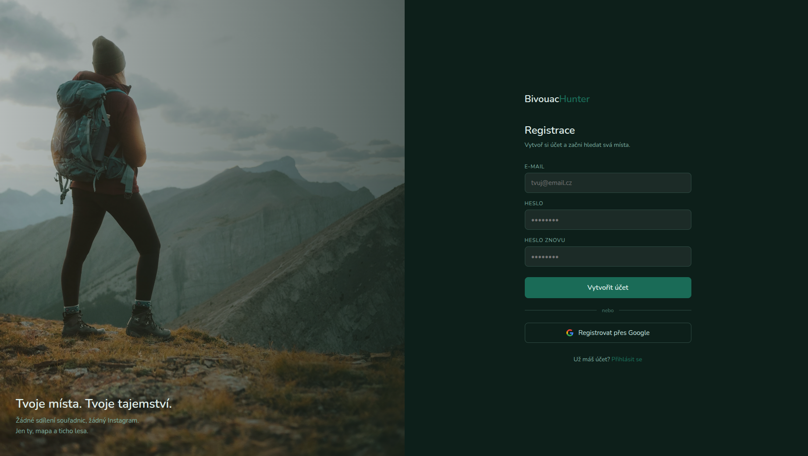

# 🏕️ BivouacHunter

> *Digitální protipól k sociálním sítím. Diskrétní a bezpečný průvodce divočinou.*

## Náhled

---

## Proč BivouacHunter?

Jako žena věnující se solo turistice a spaní venku vnímám dva zásadní problémy současných mapových aplikací:

- **Ztráta soukromí** kvůli masovému sdílení míst na sociálních sítích
- **Pocit nejistoty** při plánování noclehu o samotě

BivouacHunter je odpovědí na obojí. Namísto sdílení *instafriendly* souřadnic slouží jako **diskrétní a bezpečný průvodce divočinou** – aplikace, která hikerům umožňuje najít klidná místa pro bivakování na základě technických parametrů, nikoli popularity.

---

## Co aplikace umí

- 🗺️ **Turistická mapa** – podklad mapy.cz s turistickými značkami, pěšinami a vrstevnicemi
- 📍 **Automatická geolokace** – mapa se zazoomuje na tvou polohu při otevření
- 🔍 **Hledání v okolí** – přístřešky a zdroje vody z OpenStreetMap v okolí nebo na viditelné ploše mapy
- 🌤️ **Počasí v reálném čase** – předpověď na 12h pro každé místo (teplota, vítr, srážky)
- 🔒 **Anonymita** – žádné sociální prvky, minimální sběr dat
- 📱 **Mobilní design** – optimalizováno pro použití v terénu

---

## Tech stack

- **Backend:** Python / Django
- **Databáze:** SQLite (vývoj)
- **Mapa:** Leaflet.js + Mapy.cz API
- **Frontend:** HTML, CSS, JavaScript
- **Geodata:** Overpass API (OpenStreetMap)
- **Počasí:** Open-Meteo API
- **Autentizace:** django-allauth (email + Google OAuth)

---

## Aktuální stav

Projekt je ve fázi aktivního vývoje (MVP).

### Hotovo ✅
- Django projekt a databázový model pro bivouac místa
- Admin rozhraní pro správu spotů
- Interaktivní mapa s turistickým podkladem mapy.cz
- Automatická geolokace při načtení
- Hledání přístřešků a pramenů přes Overpass API (OSM)
- Tlačítko "Hledat v této oblasti" po pohybu mapou
- Filtrační panel – zdroj vody, přístřešek, nadmořská výška
- Počasí v popupu – teplota, vítr se směrem, srážky na 12h
- Registrace a přihlášení (email + heslo + Google OAuth)
- Auth stránky s fotkou na pozadí
- Mobilní user panel (přihlášení, odhlášení, budoucí funkce)
- Responzivní design pro mobil
- Oddělené statické soubory (CSS, JS)
- Čistá URL struktura (/login/, /signup/)

### Plánováno 🔜
- Privátní spoty pro přihlášeného uživatele
- Heatmapa vhodných míst z DMT/lidarových dat
- Analýza terénu – sklon a orientace svahu
- Zakázané zóny (NP, rezervace) z AOPK dat
- PWA + offline režim
- Internacionalizace (EN jako výchozí jazyk)

---

## Filozofie projektu

BivouacHunter není další sociální síť pro sdílení míst. Je to **osobní nástroj** – tichý, diskrétní, funkční. Místa nejsou hodnocena lajky, nejsou veřejně sdílena souřadnicemi. Bezpečnost a soukromí hikera jsou na prvním místě.

---

*Projekt vzniká jako osobní iniciativa solo hikerky z lásky k divočině a touze po klidném, bezpečném noclehu pod hvězdami.*